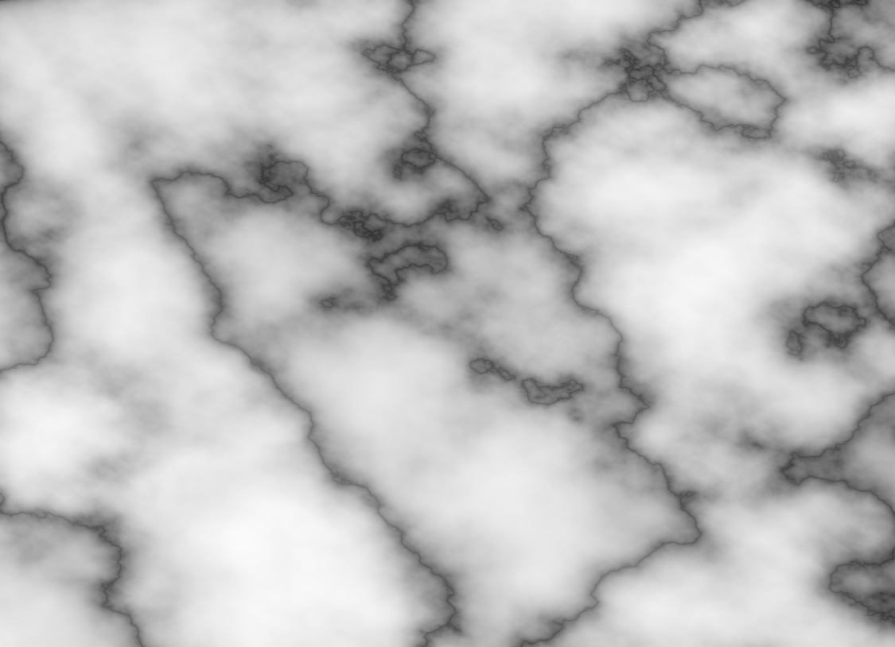

## Marble Gimp Plugin


Render Marble wallpaper in Gimp using this GEGL plugin

Plugin goes in a special directory and will **NOT** work in the normal plugins folder.

**Windows**

 C:\Users\(USERNAME)\AppData\Local\gegl-0.4\plug-ins
 
 **Linux** 

 /home/(USERNAME)/.local/share/gegl-0.4/plug-ins
 
**Linux (Flatpak includes Chromebook)**

 /home/(USERNAME)/.var/app/org.gimp.GIMP/data/gegl-0.4/plug-ins


## Compiling and Installing

### Linux

To compile and install you will need the GEGL header files (`libgegl-dev` on
Debian based distributions or `gegl` on Arch Linux) and meson (`meson` on
most distributions).

```bash
meson setup --buildtype=release build
ninja -C build

```

If you have an older version of gegl you may need to copy to `~/.local/share/gegl-0.3/plug-ins`
instead (on Ubuntu 18.04 for example).

BEAVER RECOMMENDS YOU USE A MODERN VERSION OF GEGL. NO GUARANTEE DATED VERSIONS OF GIMP WILL WORK WITH THIS PLUGIN 

### Windows

The easiest way to compile this project on Windows is by using msys2.  Download
and install it from here: https://www.msys2.org/

Open a msys2 terminal with `C:\msys64\mingw64.exe`.  Run the following to
install required build dependencies:

```bash
pacman --noconfirm -S base-devel mingw-w64-x86_64-toolchain mingw-w64-x86_64-meson mingw-w64-x86_64-gegl
```

Then build the same way you would on Linux:

```bash
meson setup --buildtype=release build
ninja -C build
```


## Another Preview of this based Gimp Plugin


